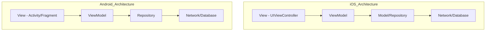
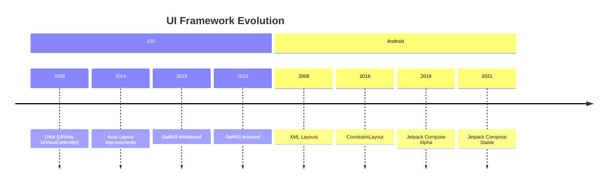
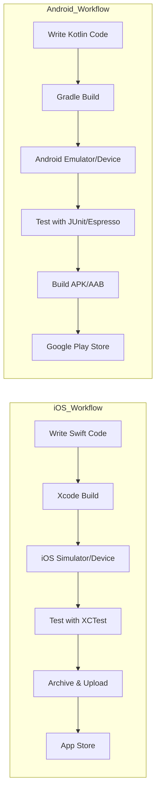
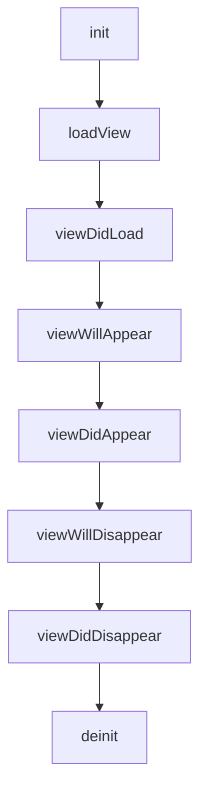
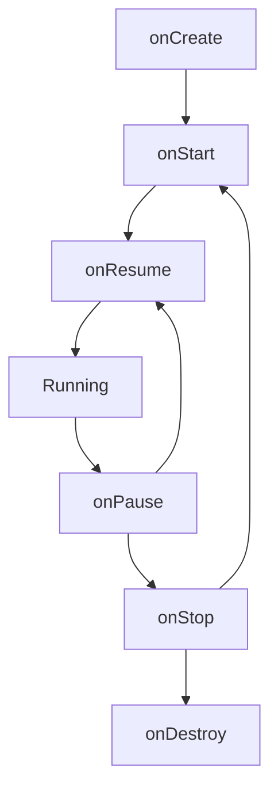
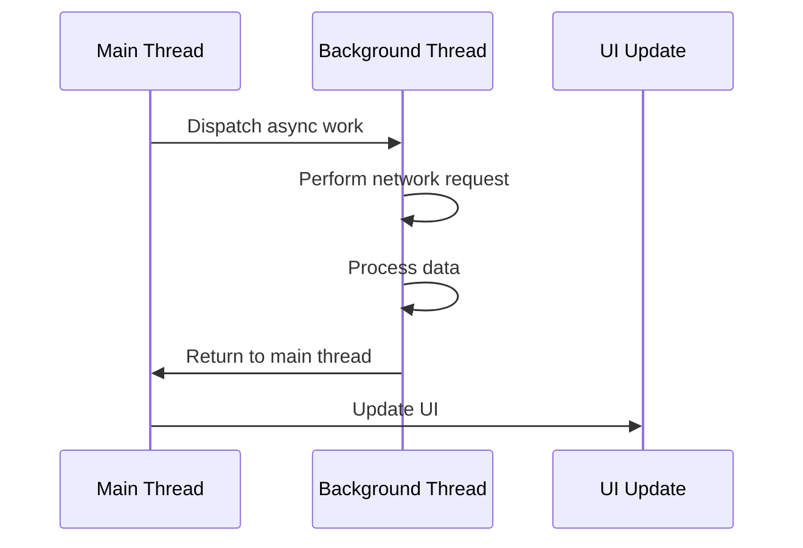
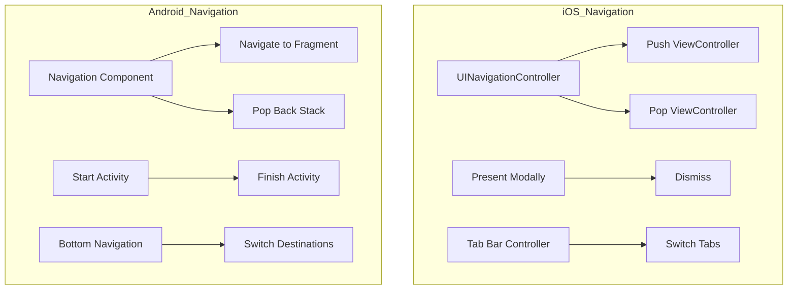

# Swift/iOS vs Android: Comprehensive Comparison

## Table of Contents
1. [Programming Languages](#programming-languages)
2. [Architecture Patterns](#architecture-patterns)
3. [UI Development](#ui-development)
4. [Key Concepts & Keywords](#key-concepts--keywords)
5. [Development Tools](#development-tools)
6. [App Lifecycle](#app-lifecycle)
7. [Memory Management](#memory-management)
8. [Concurrency](#concurrency)
9. [Dependency Management](#dependency-management)

---

## Programming Languages

| Aspect | Swift/iOS | Android |
|--------|-----------|---------|
| **Primary Language** | Swift | Kotlin |
| **Legacy Language** | Objective-C | Java |
| **Language Paradigm** | Multi-paradigm (Protocol-oriented, OOP, Functional) | Multi-paradigm (OOP, Functional) |
| **Type System** | Strong, Static | Strong, Static |
| **Null Safety** | Optionals (`?`, `!`) | Nullable types (`?`, `!!`) |
| **First Release** | Swift: 2014 | Kotlin: 2011 (official 2017) |
| **Open Source** | Yes (2015) | Yes |

### Code Comparison Example

**Swift:**
```swift
var name: String? = "John"
let greeting = "Hello, \(name ?? "Guest")"
```

**Kotlin:**
```kotlin
var name: String? = "John"
val greeting = "Hello, ${name ?: "Guest"}"
```

---

## Architecture Patterns

### Common Patterns Comparison

| Pattern | iOS Implementation | Android Implementation |
|---------|-------------------|----------------------|
| **MVC** | Model-View-Controller (Native) | Model-View-Controller |
| **MVVM** | Model-View-ViewModel | Model-View-ViewModel |
| **MVP** | Model-View-Presenter | Model-View-Presenter (Popular) |
| **VIPER** | View-Interactor-Presenter-Entity-Router | Rarely used |
| **Clean Architecture** | Supported | Widely used |
| **Reactive** | Combine, RxSwift | RxJava, Flow, LiveData |

### Architecture Diagram



---

## UI Development

### UI Framework Comparison

| Feature | iOS | Android |
|---------|-----|---------|
| **Modern Framework** | SwiftUI (declarative) | Jetpack Compose (declarative) |
| **Legacy Framework** | UIKit (imperative) | XML Layouts + Views (imperative) |
| **Layout System** | Auto Layout, Stack Views | ConstraintLayout, LinearLayout, etc. |
| **Interface Builder** | Storyboards, XIB files | XML layout files |
| **Live Preview** | Canvas in Xcode | Layout Editor, Preview in Android Studio |
| **Reactive Updates** | @State, @Binding, @ObservedObject | State, remember, mutableStateOf |

### UI Development Evolution



### Modern UI Code Comparison

**SwiftUI (iOS):**
```swift
struct ContentView: View {
    @State private var count = 0

    var body: some View {
        VStack {
            Text("Count: \(count)")
            Button("Increment") {
                count += 1
            }
        }
    }
}
```

**Jetpack Compose (Android):**
```kotlin
@Composable
fun ContentView() {
    var count by remember { mutableStateOf(0) }

    Column {
        Text("Count: $count")
        Button(onClick = { count++ }) {
            Text("Increment")
        }
    }
}
```

---

## Key Concepts & Keywords

### Core Concepts Comparison Table

| Concept | iOS/Swift | Android/Kotlin | Description |
|---------|-----------|----------------|-------------|
| **Screen/View Controller** | `UIViewController` | `Activity`, `Fragment` | Manages a screen of content |
| **View Component** | `UIView` | `View` | Basic UI building block |
| **Navigation** | `UINavigationController` | `Navigation Component`, `Intent` | Screen navigation management |
| **List View** | `UITableView`, `UICollectionView` | `RecyclerView`, `ListView` | Display scrollable lists |
| **Network Request** | `URLSession` | `OkHttp`, `Retrofit` | HTTP networking |
| **Local Storage** | `UserDefaults`, `CoreData`, `Realm` | `SharedPreferences`, `Room`, `SQLite` | Data persistence |
| **Async Programming** | `async/await`, Combine | `Coroutines`, Flow | Asynchronous operations |
| **Dependency Injection** | Manual, Swinject | Dagger, Hilt, Koin | DI frameworks |
| **Image Loading** | `UIImage`, SDWebImage, Kingfisher | Glide, Picasso, Coil | Image handling |
| **JSON Parsing** | `Codable` | `Gson`, `Moshi`, Kotlinx.serialization | JSON serialization |

### Swift-Specific Keywords

| Keyword | Purpose | Android Equivalent |
|---------|---------|-------------------|
| `let` | Immutable variable | `val` |
| `var` | Mutable variable | `var` |
| `func` | Function declaration | `fun` |
| `class` | Class definition | `class` |
| `struct` | Value type (copied) | `data class` (similar) |
| `enum` | Enumeration | `enum class` |
| `protocol` | Interface/Contract | `interface` |
| `extension` | Add functionality to types | Extension functions |
| `guard` | Early exit pattern | `require()`, early return |
| `defer` | Execute code when leaving scope | `try-finally` |
| `weak`, `unowned` | Memory management | No direct equivalent (GC) |
| `@escaping` | Closure outlives function | Higher-order functions |
| `@State` | SwiftUI state | `remember { mutableStateOf() }` |
| `@Binding` | Two-way binding | `mutableStateOf()` |
| `@ObservedObject` | Observable object | `LiveData`, `StateFlow` |

### iOS-Specific Keywords

| Keyword | Purpose | Android Equivalent |
|---------|---------|-------------------|
| `IBOutlet` | Interface Builder outlet | `findViewById()`, View Binding |
| `IBAction` | Interface Builder action | `setOnClickListener()` |
| `@objc` | Expose to Objective-C | `@JvmStatic` |
| `override` | Override method | `override` |
| `final` | Prevent inheritance | `final` |
| `lazy` | Lazy initialization | `lazy` |
| `required` | Required initializer | Constructor requirements |

---

## Development Tools

| Tool Category | iOS | Android |
|--------------|-----|---------|
| **IDE** | Xcode | Android Studio |
| **Build System** | Xcode Build System, Swift Package Manager | Gradle |
| **Package Manager** | CocoaPods, Carthage, SPM | Maven, Gradle |
| **Emulator** | iOS Simulator | Android Emulator |
| **Design Tools** | Sketch, Figma, Xcode Interface Builder | Figma, Android Studio Layout Editor |
| **Testing Framework** | XCTest, XCUITest | JUnit, Espresso, Robolectric |
| **Debugging** | LLDB, Instruments | Android Profiler, Debugger |
| **CI/CD** | Xcode Cloud, Fastlane, GitHub Actions | Firebase App Distribution, GitHub Actions |

### Development Workflow Diagram



---

## App Lifecycle

### Lifecycle States Comparison

| iOS State | iOS Method | Android State | Android Method |
|-----------|-----------|---------------|----------------|
| Not Running | - | Not Created | - |
| Inactive | `applicationWillResignActive` | - | - |
| Active | `applicationDidBecomeActive` | Resumed | `onResume()` |
| Background | `applicationDidEnterBackground` | Paused | `onPause()` |
| Suspended | - | Stopped | `onStop()` |
| - | - | Destroyed | `onDestroy()` |

### iOS View Controller Lifecycle



### Android Activity Lifecycle



### Lifecycle Methods Comparison

**iOS UIViewController:**
```swift
class ViewController: UIViewController {
    override func viewDidLoad() {
        super.viewDidLoad()
        // Setup view
    }

    override func viewWillAppear(_ animated: Bool) {
        super.viewWillAppear(animated)
        // View about to appear
    }

    override func viewDidAppear(_ animated: Bool) {
        super.viewDidAppear(animated)
        // View appeared
    }
}
```

**Android Activity:**
```kotlin
class MainActivity : AppCompatActivity() {
    override fun onCreate(savedInstanceState: Bundle?) {
        super.onCreate(savedInstanceState)
        setContentView(R.layout.activity_main)
        // Setup view
    }

    override fun onStart() {
        super.onStart()
        // Activity started
    }

    override fun onResume() {
        super.onResume()
        // Activity resumed
    }
}
```

---

## Memory Management

| Aspect | iOS/Swift | Android/Kotlin |
|--------|-----------|----------------|
| **Memory Model** | Automatic Reference Counting (ARC) | Garbage Collection (GC) |
| **Manual Control** | Yes (weak, unowned references) | Limited |
| **Retain Cycles** | Must be prevented manually | Handled by GC |
| **Memory Leaks** | Can occur with strong reference cycles | Less common |
| **Deallocation** | `deinit` | `finalize()` (deprecated) |

### Memory Management Diagram

```mermaid
graph TB
    subgraph iOS_ARC
        A1[Object Created] --> B1[Reference Count: 1]
        B1 --> C1[Strong Reference Added]
        C1 --> D1[Reference Count: 2]
        D1 --> E1[References Released]
        E1 --> F1[Reference Count: 0]
        F1 --> G1[Object Deallocated]
    end

    subgraph Android_GC
        A2[Object Created] --> B2[Heap Memory]
        B2 --> C2[No More References]
        C2 --> D2[Marked for Collection]
        D2 --> E2[GC Runs]
        E2 --> F2[Object Removed]
    end
```



### Preventing Memory Leaks

**iOS - Weak References:**
```swift
class ViewController: UIViewController {
    var closure: (() -> Void)?

    func setupClosure() {
        closure = { [weak self] in
            self?.doSomething()
        }
    }
}
```

**Android - Lifecycle Awareness:**
```kotlin
class MyActivity : AppCompatActivity() {
    private val viewModel: MyViewModel by viewModels()

    override fun onCreate(savedInstanceState: Bundle?) {
        super.onCreate(savedInstanceState)

        viewModel.data.observe(this) { data ->
            // Automatically cleaned up
        }
    }
}
```

---

## Concurrency

### Concurrency Models

| Feature | iOS/Swift | Android/Kotlin |
|---------|-----------|----------------|
| **Modern Approach** | async/await (Swift 5.5+) | Coroutines |
| **Thread Management** | Grand Central Dispatch (GCD) | Thread Pools, Executors |
| **Main Thread** | `DispatchQueue.main` | `Dispatchers.Main` |
| **Background Thread** | `DispatchQueue.global()` | `Dispatchers.IO`, `Dispatchers.Default` |
| **Reactive** | Combine framework | Flow, LiveData |
| **Legacy** | NSOperation, NSThread | AsyncTask (deprecated), Runnable |

### Concurrency Pattern Comparison

**Swift async/await:**
```swift
func fetchData() async throws -> Data {
    let url = URL(string: "https://api.example.com/data")!
    let (data, _) = try await URLSession.shared.data(from: url)
    return data
}

Task {
    do {
        let data = try await fetchData()
        await MainActor.run {
            // Update UI
        }
    } catch {
        print("Error: \(error)")
    }
}
```

**Kotlin Coroutines:**
```kotlin
suspend fun fetchData(): Data {
    return withContext(Dispatchers.IO) {
        val url = URL("https://api.example.com/data")
        url.readBytes()
    }
}

lifecycleScope.launch {
    try {
        val data = fetchData()
        withContext(Dispatchers.Main) {
            // Update UI
        }
    } catch (e: Exception) {
        println("Error: $e")
    }
}
```

### Concurrency Execution Flow



---

## Dependency Management

| Aspect | iOS | Android |
|--------|-----|---------|
| **Official Tool** | Swift Package Manager (SPM) | Gradle |
| **Community Tools** | CocoaPods, Carthage | Maven (less common) |
| **Configuration File** | `Package.swift`, `Podfile` | `build.gradle`, `build.gradle.kts` |
| **Repository** | Swift Package Index, CocoaPods | Maven Central, JCenter |
| **Version Management** | Semantic versioning | Semantic versioning |

### Dependency Declaration Examples

**Swift Package Manager (Package.swift):**
```swift
// Package.swift
let package = Package(
    name: "MyApp",
    dependencies: [
        .package(url: "https://github.com/Alamofire/Alamofire.git", from: "5.6.0"),
        .package(url: "https://github.com/onevcat/Kingfisher.git", from: "7.0.0")
    ],
    targets: [
        .target(name: "MyApp", dependencies: ["Alamofire", "Kingfisher"])
    ]
)
```

**CocoaPods (Podfile):**
```ruby
# Podfile
platform :ios, '15.0'
use_frameworks!

target 'MyApp' do
  pod 'Alamofire', '~> 5.6'
  pod 'Kingfisher', '~> 7.0'
end
```

**Gradle (build.gradle.kts):**
```kotlin
// build.gradle.kts
dependencies {
    implementation("com.squareup.retrofit2:retrofit:2.9.0")
    implementation("io.coil-kt:coil:2.4.0")
    implementation("org.jetbrains.kotlinx:kotlinx-coroutines-android:1.7.3")
}
```

---

## Key iOS Frameworks & Android Equivalents

| iOS Framework | Purpose | Android Equivalent |
|---------------|---------|-------------------|
| **UIKit** | UI framework | Android Views, Jetpack |
| **SwiftUI** | Declarative UI | Jetpack Compose |
| **Foundation** | Core utilities | Kotlin Standard Library, Android SDK |
| **CoreData** | Object-relational mapping | Room, SQLite |
| **CoreLocation** | Location services | Location Services API |
| **MapKit** | Maps integration | Google Maps SDK |
| **AVFoundation** | Audio/Video playback | MediaPlayer, ExoPlayer |
| **CoreAnimation** | Animations | Animation API, Transitions |
| **CoreGraphics** | 2D graphics | Canvas, Custom Views |
| **StoreKit** | In-app purchases | Google Play Billing |
| **UserNotifications** | Push notifications | Firebase Cloud Messaging |
| **Combine** | Reactive programming | Flow, LiveData, RxJava |
| **HealthKit** | Health data | Google Fit API |
| **ARKit** | Augmented reality | ARCore |
| **CoreML** | Machine learning | ML Kit, TensorFlow Lite |

---

## Common Design Patterns

### Delegation Pattern

**iOS (Protocol/Delegate):**
```swift
protocol DataDelegate: AnyObject {
    func didReceiveData(_ data: String)
}

class DataManager {
    weak var delegate: DataDelegate?

    func fetchData() {
        let data = "Sample Data"
        delegate?.didReceiveData(data)
    }
}

class ViewController: UIViewController, DataDelegate {
    func didReceiveData(_ data: String) {
        print("Received: \(data)")
    }
}
```

**Android (Interface/Listener):**
```kotlin
interface DataListener {
    fun onDataReceived(data: String)
}

class DataManager {
    var listener: DataListener? = null

    fun fetchData() {
        val data = "Sample Data"
        listener?.onDataReceived(data)
    }
}

class MainActivity : AppCompatActivity(), DataListener {
    override fun onDataReceived(data: String) {
        println("Received: $data")
    }
}
```

### Singleton Pattern

**iOS:**
```swift
class NetworkManager {
    static let shared = NetworkManager()
    private init() {}

    func request() {
        // Network request
    }
}

// Usage
NetworkManager.shared.request()
```

**Android:**
```kotlin
object NetworkManager {
    fun request() {
        // Network request
    }
}

// Usage
NetworkManager.request()
```

---

## Navigation Patterns



---

## Testing Comparison

| Test Type | iOS | Android |
|-----------|-----|---------|
| **Unit Testing** | XCTest | JUnit, Kotlin Test |
| **UI Testing** | XCUITest | Espresso, UI Automator |
| **Mocking** | XCTest protocols, Cuckoo | Mockito, MockK |
| **Test Runner** | Xcode Test Navigator | Android Studio, Gradle |
| **Code Coverage** | Xcode Code Coverage | JaCoCo |
| **Snapshot Testing** | SnapshotTesting library | Screenshot Testing |

---

## Security Features

| Feature | iOS | Android |
|---------|-----|---------|
| **Keychain** | Keychain Services | Keystore |
| **Biometric Auth** | LocalAuthentication (Face ID, Touch ID) | BiometricPrompt |
| **App Permissions** | Info.plist declarations | Manifest permissions |
| **Secure Storage** | Keychain | EncryptedSharedPreferences |
| **Certificate Pinning** | URLSession configuration | OkHttp interceptors |
| **Code Signing** | Automatic with Xcode | APK/AAB signing |

---

## Summary: Key Differences

| Aspect | iOS/Swift | Android/Kotlin |
|--------|-----------|----------------|
| **Ecosystem** | Closed, Apple-controlled | Open source, multiple vendors |
| **Fragmentation** | Low (controlled OS updates) | Higher (various manufacturers) |
| **Development Cost** | Requires Mac | Cross-platform development |
| **App Distribution** | App Store (strict review) | Google Play, alternative stores |
| **Programming Style** | Protocol-oriented | Interface-based OOP |
| **Memory Management** | ARC (manual awareness needed) | GC (automatic) |
| **UI Paradigm** | SwiftUI (newer), UIKit (mature) | Compose (newer), XML Views (mature) |
| **Market Share** | ~27% global, higher in US | ~72% global |

---

## Glossary

### iOS/Swift Terms
- **ARC**: Automatic Reference Counting
- **Cocoa Touch**: iOS framework collection
- **Storyboard**: Visual interface design file
- **IBOutlet**: Interface Builder connection to code
- **Protocol**: Similar to interface, defines method contracts
- **Extension**: Add functionality to existing types
- **Guard**: Early exit control flow
- **Optionals**: Type-safe handling of nil values

### Android/Kotlin Terms
- **APK**: Android Package Kit
- **AAB**: Android App Bundle
- **Manifest**: App configuration file
- **Intent**: Message passing between components
- **RecyclerView**: Efficient list display
- **Fragment**: Reusable UI component
- **ViewModel**: Lifecycle-aware data holder
- **Coroutine**: Lightweight concurrency primitive

---

## Resources

### iOS/Swift Learning
- [Swift.org](https://swift.org)
- [Apple Developer Documentation](https://developer.apple.com/documentation/)
- [WWDC Videos](https://developer.apple.com/videos/)
- [Hacking with Swift](https://www.hackingwithswift.com)

### Android/Kotlin Learning
- [Kotlin Lang](https://kotlinlang.org)
- [Android Developers](https://developer.android.com)
- [Android Jetpack](https://developer.android.com/jetpack)
- [Kotlin by Example](https://play.kotlinlang.org/byExample/overview)

---

*This comparison is current as of 2025. Both ecosystems continue to evolve rapidly.*
